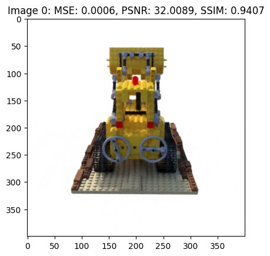

# Nerf_3d_reconstruction

# **Problem statement**

The problem at hand focuses on how scenes are represented for view synthesis and rendering in computer graphics. The challenge lies in accurately reconstructing complex scenes with high-resolution geometry and appearance using neural networks. This is a significant problem because traditional 3D reconstruction methods often rely on discrete representations like voxel grids or triangle meshes, which struggle to capture the fine details and intricate geometry of real-world scenes.

The NeRF (Neural Radiance Fields) algorithm seeks to address these limitations by introducing a new approach that represents scenes as continuous neural radiance fields. NeRF uses a fully connected deep network to map 5D coordinates to volume density and view-dependent emitted radiance, allowing for the synthesis of photorealistic novel views of scenes with complex geometry and appearance.

This innovative method not only improves the fidelity of scene reconstruction but also offers a more efficient and effective way to optimize scene representations for rendering realistic images. Therefore, researching how to enhance scene representation through neural radiance fields is essential for advancing computer graphics, enabling the creation of visually compelling and detailed virtual environments that closely resemble real-world scenes.

# **Introduction**

NeRF (Neural Radiance Fields) is a groundbreaking algorithm for synthesizing novel views of complex scenes with photorealistic quality. This method represents scenes using a continuous volumetric scene function optimized with a sparse set of input views, enabling the rendering of scenes with intricate geometry and appearance.

NeRF leverages a fully-connected deep network to model scenes, allowing for high-fidelity rendering of scenes from novel viewpoints. By learning the radiance field of a scene, NeRF can generate images with realistic lighting, reflections, and shadows. The algorithm excels at capturing fine details and complex lighting effects, making it a powerful tool for computer graphics and virtual reality applications.

Key Features
- High-Quality Rendering: NeRF produces images with exceptional visual quality, capturing intricate scene details and realistic lighting effects.
- View Synthesis: The algorithm can generate novel views of a scene from arbitrary viewpoints, enabling virtual exploration of 3D environments.
- Sparse Input Views: NeRF requires only a sparse set of input views to optimize the scene representation, making it efficient and scalable for complex scenes.
- Photorealistic Results: By modeling the radiance field, NeRF achieves photorealistic rendering that rivals traditional rendering techniques.


# **Results**




# **Usage**

Clone the Repository

```bash
git clone https://github.com/your-username/nerf-pipeline.git
cd nerf-pipeline
```
Create a Virtual Environment

```bash
python -m venv venv
source venv/bin/activate  # On Windows use `venv\Scripts\activate`
```
Install the Requirements

```bash
pip install -r requirements.txt
```

Dataset 
```bash
https://drive.google.com/drive/folders/18bwm-RiHETRCS5yD9G00seFIcrJHIvD-
```

Run the script
```bash
python main.py

```
File Structure


- main.py: The entry point of the application.
- model.py: Contains the NerfModel class.
- losses.py: Contains the loss functions (mse, psnr, ssim).
- utils.py: Contains utility functions (compute_accumulated_transmittance, render_rays).
- train.py: Contains the training and testing functions.

